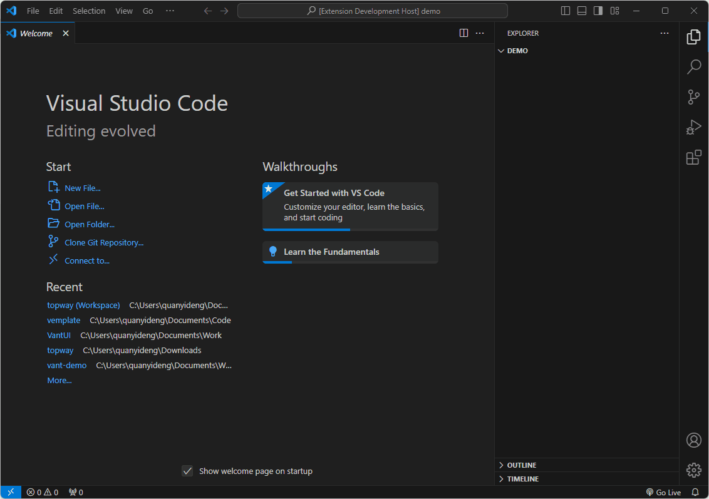

# Vemplate 使用说明

## 功能

- 快速创建`vue2`、`vue3`常用模板的`vue`文件
- 预设了丰富的`snippets`文件模板

## 使用

1. 右键文件夹，选择 Vemplate
2. 输入文件名称
3. 选择`Snippets`模板，按下回车键即可成功创建带有模板的`vue`文件

## 自定义模板

Vemplate 新建文件是通过 Snippets 插入模板内容的，因此可以自定义模板。

1. 按下`Ctrl`+`Shift`+`p`
2. 搜索`Snippets`，选择`Snippets: Configure Snippets`
3. 选择`New Glogal Snippets file`，即可编写自定义模板

## Release Notes

Vemplate Release Notes

### 1.0.0

- feat：模板可以通过`Snippes`自定义
- perf: 添加更多常用模板
- fix: 修复文件名为`undefined`、文件名重复问题

### 0.0.4

- 添加操作说明动图
- 添加更多常用模板

### 0.0.3

- 更新 README 说明文档
- 修复生成错误的模板

### 0.0.2

- 添加插件图标
- 更新 README 说明文档

### 0.0.1

- Initial release of Vemplate
